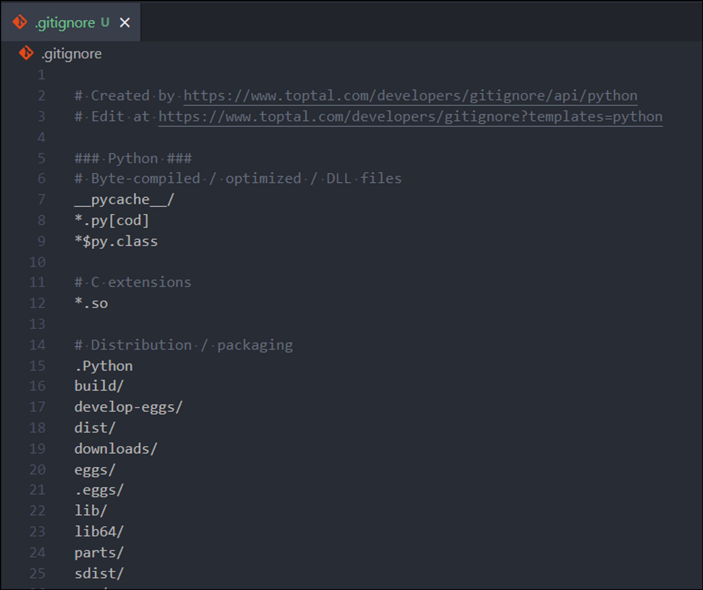

# 22.12.27(화)
>주요 학습 : clone, pull, branch merge, Git workflow


## 1. README.md로 깃퍼브 프로필 꾸미기


## 2. clone, pull
>원격 저장소의 내용을 로컬저장소로 갖고오기

1. git clone : 복제 
    - 원격 저장소에서 복제하고자 하는 repository를 모두 갖고옴 (로컬에 복제)
    - git clone을 통해 생성된 로컬저장소는 이미 `git init`과 `git remote add {URL}`이 수행 돼있음
    ```bash
    git clone 원격 URL
    Cloning into '저장소 이름'...
    remote: Enumerating objects: 3, done.
    remote: Counting objects: 100% (3/3), done.
    remote: Total 3 (delta 0), reused 3 (delta 0), pack-reused 0
    Receiving objects: 100% (3/3), done.
    ```

2. git pull 
   - 원격 저장소에 올라와있는 변경사항 가져와 로컬 저장소 업뎃
   - 로컬 저장소와 원격 저장소의 내용이 완벽히 일치하면 변화가 없음 
   ```bash 
   git pull -u origin master 
   From https://github.com/edukyle/git-practice
   branch            master     -> FETCH_HEAD
   Updating 6570ecb..56809a9
   Fast-forward
   README.md | 1 +
   1 file changed, 1 insertion(+)  
   ```     
   > **git pull** : git push처럼 로컬 저장소와 원격 저장소의 내용을 동기화하고 싶다면 언제든 사용. 단, *push*는 로컬 저장소의 변경 내용을 원격 저장소에 반영하는 것이고, *pull*은 원격 저장소의 변경 내용을 로컬 저장소에 반영하는 것입니다. 즉 방향이 다름!
   
   > **git clone** : git init처럼 처음에 한 번만 실행


## 3. gitignore
> 특정 파일 / 폴더에 git이 버전관리 하지 못하도록 함 

1. gitignore에 작성하는 목록
   - 민감한 개인정보가 담긴 파일 (전화번호, 계좌번호, 비밀번호, API KEY)
   - OS(운영체제) 에서 활용되는 파일
   - IDE(통합 계발 환경 ex. pycharm) / Text editor(ex. vscode) 에서 활용되는 파일 (ex. .idea/)
   - 개발언어 / 프레임워크(django) 에서 사용되는 파일 (가상환경: venv/)

2. 주의사항
   - 반드시 이름을 **.gitignore** 로 작성 (앞의 점(.) = 숨김파일)
   - .gitignore 파일은 .git폴더와 동일한 폴더에 위치
   - 제외하려는 파일은 반드시 `git add` 하기 전에 .gitignore 작성

3. 쉽게 작성하는 법
   - [웹사이트](https://www.toptal.com/developers/gitignore/) 
   - [저장소](https://github.com/github/gitignore)
   - 

4. 심화
    -  아무것도 없는 라인이나, `#`로 시작하는 라인은 무시합니다.
    - `슬래시(/)`로 시작하면 하위 디렉터리에 재귀적으로 적용되지 않습니다.
    - 디렉토리는 `슬래시(/)`를 끝에 사용하는 것으로 표현합니다.
    - `느낌표(!)`로 시작하는 패턴의 파일은 ignore(무시)하지 않습니다.
    - **표준 Glob 패턴을 사용합니다.**
      - `*(asterisk)`는 문자가 하나도 없거나 하나 이상을 의미합니다.
      - `[abc]`는 중괄호 안에 있는 문자 중 하나를 의미합니다.
      - `물음표(?)`는 문자 하나를 의미합니다.
      - `[0-9]`처럼 중괄호 안에 하이픈(-)이 있는 경우 0에서 9사이의 문자 중 하나를 의미합니다.
      - `**(2개의 asterisk)`는 디렉터리 내부의 디렉터리까지 지정할 수 있습니다.
      (`a/**/z`라고 작성하면 `a/z`, `a/b/z`, `a/b/c/z` 까지 모두 영향을 끼칩니다.)


## 4. branch
1. 개요 
    - 독립공간을 형성 -> 원본을 건드리지 X
    - 하나의 작업 = 하나의 branch -> 체계적 개발 가능
    - git은 branch를 만드는 속도가 빠르고 용량이 적음 
    - master : 상용화 되는 branch 

2. Branch 생성 명령
    - `git branch` : 생성 돼 있는 브랜치 목록 확인
    - `git branch -r` : 원격 저장소의 branch 목록 확인
    - `git branch 생성할 branch 이름` : branch 생성
    - `git branch 이름 커밋ID` : 특정 commit 기준으로 branch 생성
    - `git branch -d 이름` : 병합된 branch만 삭제 가능 
    - `git branch -D 이름` : **주의** !! 강제 삭제 (병합 되지 않은 branch도 삭제 가능)

3. git switch : 현재 branch에서 다른 branch로 Head를 변경
    - Head : 현재 로그된 branch 
    ```bash
    git switch 이름 #다른 branch로 이동
    git switch -c 이름 #새로 생성과 동시에 생성한 branch로 이동
    git switch -c 이름 커밋ID #특정 커밋 기준으로 브랜치 생성 + 이동

## 5. branch merge

## 6. Git workflow 개념
## 7. Git workflow 실습 